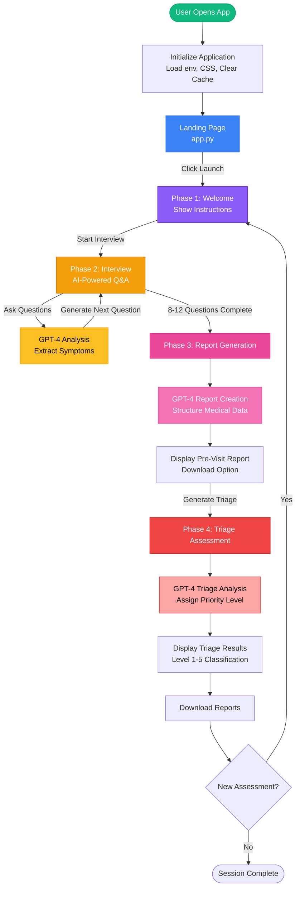
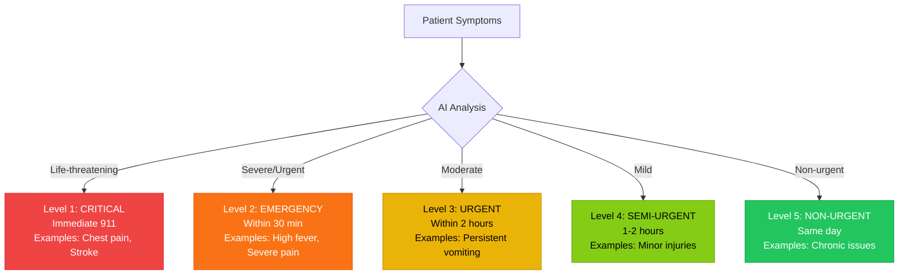
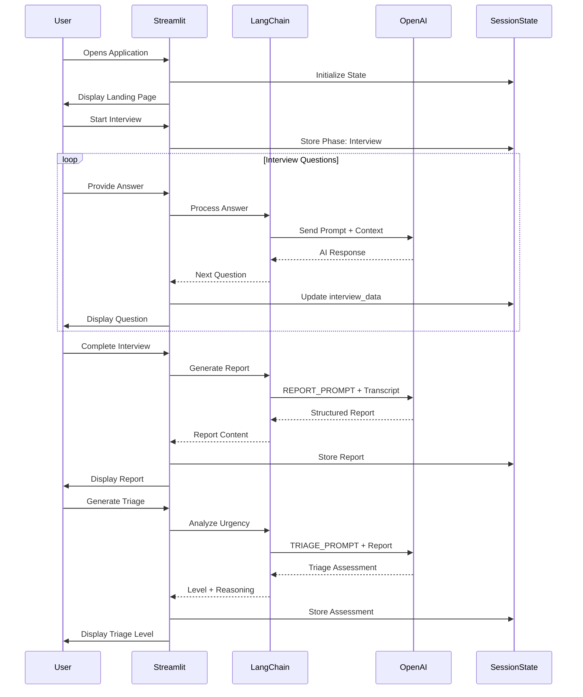
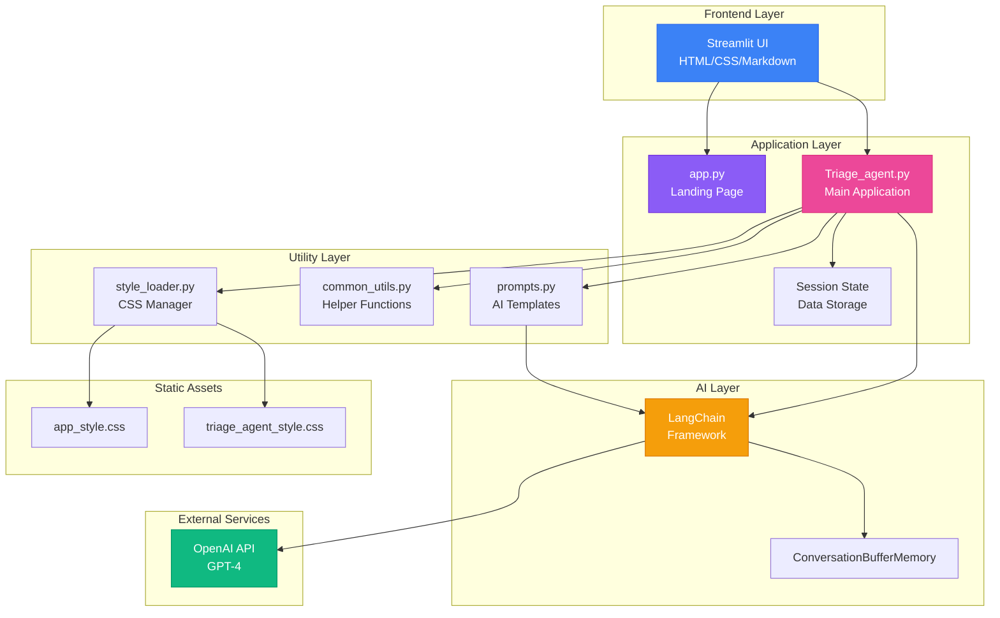
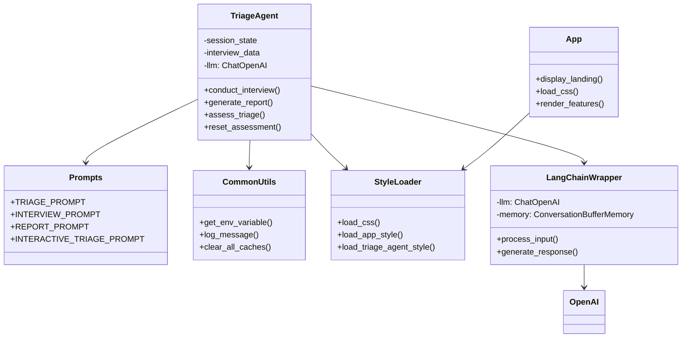
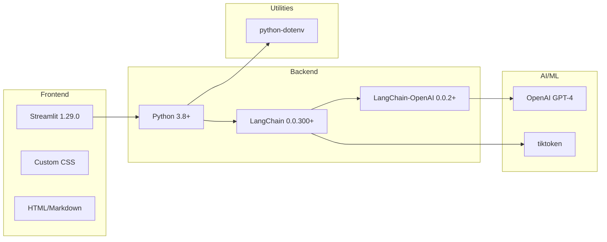

# 🏥 Multi-Agent Healthcare AI System

A comprehensive multi-agent healthcare AI platform built with Streamlit, LangChain, and Hugging Face. The system features specialized AI agents for medical diagnostics, treatment recommendations, radiology analysis, dermatology assessment, and patient triage—all orchestrated through an intelligent Supervisor Agent.

## 📋 Table of Contents

- [Overview](#overview)
- [System Workflow](#system-workflow)
- [Architecture](#architecture)
- [Features](#features)
- [Installation](#installation)
- [Usage](#usage)
- [Project Structure](#project-structure)
- [Configuration](#configuration)
- [Technologies](#technologies)

---

## 🎯 Overview

The Medical Triage AI Agent is a multi-phase intelligent system that:
- Conducts structured patient interviews using conversational AI
- Collects comprehensive medical information systematically
- Generates detailed pre-visit reports for healthcare providers
- Assigns triage priority levels (1-5) based on urgency
- Provides actionable recommendations for appropriate care pathways

**⚠️ DISCLAIMER**: This is a prototype for educational purposes. Always consult healthcare professionals for medical advice.

---

## 🔄 System Workflow

### Overall System Flow



### Triage Level Classification



### Data Flow Architecture



---

## 🏗️ Architecture

### System Architecture Diagram



### Component Architecture



### Technology Stack



---

## ✨ Features

### 🎨 Landing Page
- Modern, futuristic UI with gradient backgrounds
- Interactive feature cards with hover effects
- Clear explanation of triage AI capabilities
- Step-by-step process visualization
- Responsive design for mobile and desktop

### 🤖 AI-Powered Interview System
- Natural language conversation with GPT-4
- Context-aware follow-up questions
- Automatic symptom extraction
- Real-time data collection and tracking
- Progress indicator in sidebar
- 8-12 adaptive questions based on responses

### 📊 Intelligent Report Generation
- Comprehensive structured reports
- Medical terminology and formatting
- Sections include:
  - Chief Complaint
  - Present Illness
  - Symptom Analysis (onset, duration, severity)
  - Medical History
  - Current Medications
  - Allergies
  - Red Flags Identified
  - Provider Recommendations
- Downloadable as text files

### 🏥 Clinical Triage Assessment
- 5-level triage system (ESI/CTAS compliant)
- AI-powered urgency classification
- Color-coded visual indicators
- Critical alert system for emergencies
- Evidence-based reasoning
- Specific recommendations for each level

### 🎛️ Utility Features
- Automatic cache clearing on startup
- Session state management
- Custom CSS styling system
- Error handling with user-friendly messages
- Logging utilities for debugging
- Responsive design

---

## 🚀 Installation

### Prerequisites

- Python 3.8 or higher
- pip (Python package manager)
- OpenAI API key

### Step 1: Clone the Repository

```bash
git clone <repository-url>
cd Streamlit-App
```

### Step 2: Create Virtual Environment (Recommended)

```bash
# Windows
python -m venv venv
venv\Scripts\activate

# macOS/Linux
python3 -m venv venv
source venv/bin/activate
```

### Step 3: Install Dependencies

```bash
pip install -r requirements.txt
```

### Step 4: Configure Environment Variables

Create a `.env` file in the root directory:

```bash
OPENAI_API_KEY=your_openai_api_key_here
```

**How to get an OpenAI API key:**
1. Visit https://platform.openai.com/
2. Sign up or log in
3. Navigate to API keys section
4. Create a new API key
5. Copy and paste into `.env` file

---

## 💻 Usage

### Running the Application

```bash
streamlit run app.py
```

The application will open in your default browser at `http://localhost:8501`

### Navigation

1. **Landing Page** (`app.py`)
   - Learn about the triage AI system
   - Click "🚀 Launch Triage Agent" or use sidebar navigation

2. **Triage Agent** (sidebar: "Triage agent")
   - Start pre-visit interview
   - Answer questions naturally
   - Review generated report
   - View triage assessment

### Workflow Steps

1. **Start Interview**: Click "🚀 Start Pre-Visit Interview"
2. **Answer Questions**: Respond to AI questions about symptoms (8-12 questions)
3. **Complete Interview**: Click "✅ Complete Interview & Generate Report"
4. **Review Report**: Read the generated pre-visit report
5. **Download Report**: Save the report for your records
6. **Generate Triage**: Click "🏥 Generate Triage Assessment"
7. **Review Assessment**: View urgency level (1-5) and recommendations
8. **Download Assessment**: Save triage results
9. **New Assessment**: Click "🔄 Start New Assessment" to begin again

---

## 📁 Project Structure

```
Streamlit-App/
│
├── app.py                          # Landing page
├── .env                            # Environment variables (create this)
├── .gitignore                      # Git ignore rules
├── requirements.txt                # Python dependencies
├── README.md                       # This file
│
├── pages/                          # Streamlit multi-page app
│   └── Triage_agent.py            # Main triage application
│
├── utils/                          # Utility modules
│   ├── __init__.py
│   ├── prompts.py                 # AI prompt templates
│   ├── common_utils.py            # Helper functions
│   └── style_loader.py            # CSS loading utilities
│
└── styles/                         # CSS styling files
    ├── app_style.css              # Landing page styles
    └── triage_agent_style.css     # Triage agent styles
```

### Key Files Description

| File | Purpose | Lines |
|------|---------|-------|
| `app.py` | Main landing page with project overview | ~264 |
| `pages/Triage_agent.py` | Core triage workflow implementation | ~330 |
| `utils/prompts.py` | AI prompt templates for interview/report/triage | ~193 |
| `utils/common_utils.py` | Utility functions (logging, cache management) | ~81 |
| `utils/style_loader.py` | CSS loading and management | ~68 |
| `styles/app_style.css` | Landing page styling | ~278 |
| `styles/triage_agent_style.css` | Triage agent page styling | ~87 |

---

## ⚙️ Configuration

### Environment Variables

| Variable | Description | Required | Default |
|----------|-------------|----------|---------|
| `OPENAI_API_KEY` | Your OpenAI API key | Yes | None |

### Streamlit Configuration

```python
# Page configuration (app.py)
st.set_page_config(
    page_title="Triage AI Agent",
    page_icon="🧠",
    layout="wide",
    initial_sidebar_state="expanded"
)
```

### Model Configuration

```python
# Current configuration (Triage_agent.py)
llm = ChatOpenAI(
    temperature=0.7,
    model_name="gpt-4o-mini",
    openai_api_key=api_key
)
```

**Available Models:**
- `gpt-4` - Most capable, higher cost
- `gpt-4o-mini` - Balanced performance and cost (current)
- `gpt-3.5-turbo` - Faster, lower cost

**Temperature Settings:**
- `0.0-0.3` - More focused and deterministic
- `0.7` - Balanced creativity (current)
- `0.8-1.0` - More creative and varied

---

## 🛠️ Technologies

### Core Framework
- **Streamlit** (v1.29.0): Web application framework
- **Python** (3.8+): Programming language

### AI/ML
- **LangChain** (>=0.0.300): LLM application framework
- **LangChain-OpenAI** (>=0.0.2): OpenAI integration
- **OpenAI API** (>=0.27.8): GPT-4 access
- **tiktoken** (>=0.4.0): Token counting for OpenAI

### Utilities
- **python-dotenv** (v1.0.0): Environment variable management

### UI/UX
- **Custom CSS**: Modern glass morphism design
- **Google Fonts**: Inter font family
- **Responsive Design**: Mobile and desktop support

---

## 🔒 Security & Privacy

- **No data persistence**: All data is session-based and cleared on restart
- **API key security**: Store keys in `.env` file (never commit to Git)
- **Local processing**: All processing happens on your machine
- **No external database**: No patient data is stored externally
- **Automatic cache clearing**: Sensitive data cleared on app restart

**Important**: This is a prototype. For production use:
- Implement proper authentication
- Add encryption for sensitive data
- Comply with HIPAA/healthcare regulations
- Use secure API key management (e.g., AWS Secrets Manager)
- Add audit logging
- Implement data retention policies

---

## 🐛 Troubleshooting

### Common Issues

**1. CSS not loading or page looks unstyled**
```bash
# Solution: Restart the Streamlit app
Ctrl+C  # Stop the app
streamlit run app.py  # Restart
```
Cache is automatically cleared on startup.

**2. "Module not found" errors**
```bash
# Solution: Reinstall dependencies
pip install -r requirements.txt
```

**3. "API key not found" error**
```bash
# Solution: Check .env file
# 1. Verify .env file exists in root directory
# 2. Check format: OPENAI_API_KEY=sk-...
# 3. Restart the app after creating .env
```

**4. Triage agent page not visible in sidebar**
```bash
# Solution 1: Check sidebar is expanded (arrow in top-left)
# Solution 2: Verify langchain-openai is installed
pip install langchain-openai
# Solution 3: Restart the app
```

**5. Slow response times**
```bash
# Possible causes:
# - OpenAI API rate limits
# - Network latency
# - Large conversation history

# Solutions:
# - Check internet connection
# - Verify API quota at platform.openai.com
# - Start new assessment to clear history
```

**6. Import errors with utils modules**
```bash
# Solution: Python path issues
# The app automatically adds parent directory to path
# If still failing, run from root directory:
cd Streamlit-App
streamlit run app.py
```

---

## 📊 Performance Considerations

### Response Times
- **Interview questions**: 2-5 seconds per response
- **Report generation**: 10-20 seconds
- **Triage assessment**: 5-10 seconds

### Token Usage (Approximate)
- **Interview** (8-12 questions): 3,000-5,000 tokens
- **Report generation**: 2,000-3,000 tokens
- **Triage assessment**: 1,500-2,500 tokens
- **Total per session**: ~7,000-10,000 tokens

### Cost Estimation (GPT-4o-mini)
- **Per session**: $0.01-0.02 USD
- **100 sessions**: $1-2 USD

---

## 📝 License

This project is for educational and demonstration purposes.

---

## 🤝 Contributing

This is a prototype project. To contribute:
1. Fork the repository
2. Create a feature branch (`git checkout -b feature/AmazingFeature`)
3. Commit your changes (`git commit -m 'Add some AmazingFeature'`)
4. Push to the branch (`git push origin feature/AmazingFeature`)
5. Open a Pull Request

### Development Guidelines
- Follow PEP 8 style guide
- Add docstrings to all functions
- Update README for new features
- Test with multiple scenarios
- Keep functions small and focused

---

## 📧 Support

For questions or issues:
- Check the [Troubleshooting](#troubleshooting) section
- Review [Streamlit documentation](https://docs.streamlit.io/)
- Check [LangChain documentation](https://python.langchain.com/)
- Review [OpenAI documentation](https://platform.openai.com/docs)

---

## ⚠️ Medical Disclaimer

**THIS IS A PROTOTYPE FOR EDUCATIONAL PURPOSES ONLY**

This application:
- ❌ Is NOT approved for clinical use
- ❌ Is NOT a substitute for professional medical advice
- ❌ Should NOT be used for actual medical decisions
- ❌ Has NOT been validated by healthcare professionals
- ❌ Does NOT comply with HIPAA or medical regulations

**Always:**
- ✅ Consult qualified healthcare professionals
- ✅ Call 911 for emergencies
- ✅ Seek professional medical advice for health concerns
- ✅ Use only for educational and demonstration purposes

---

## 🎯 Future Enhancements

Potential improvements for production version:
- [ ] Multi-language support
- [ ] Voice input/output capabilities
- [ ] Integration with EHR/EMR systems
- [ ] Advanced symptom checker with medical knowledge graphs
- [ ] Patient authentication system
- [ ] Appointment scheduling integration
- [ ] PDF report generation with medical formatting
- [ ] Analytics dashboard for healthcare providers
- [ ] Mobile app version
- [ ] HIPAA compliance features

---

## 🙏 Acknowledgments

- Inspired by **Google's Appoint Ready MedGemma Demo**
- Built with **Streamlit's** amazing framework
- Powered by **OpenAI's GPT-4**
- UI design inspired by modern healthcare applications
- Triage protocols based on ESI and CTAS standards

---

## 📈 Version History

### Version 1.0.0 (January 2025)
- Initial release
- 4-phase triage workflow
- AI-powered interview system
- Report and triage generation
- Multi-page Streamlit app
- Custom CSS styling
- Utility functions and helpers

---

**Version**: 1.0.0
**Last Updated**: January 2025
**Status**: Prototype / Educational Demo
**Maintainer**: [Your Name/Organization]

---

Made with ❤️ for improving healthcare accessibility through AI

🏥 **Medical Triage AI Agent** | 🤖 **Powered by GPT-4** | 🚀 **Built with Streamlit**
