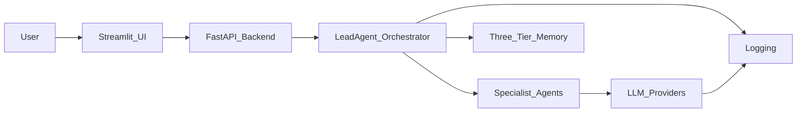
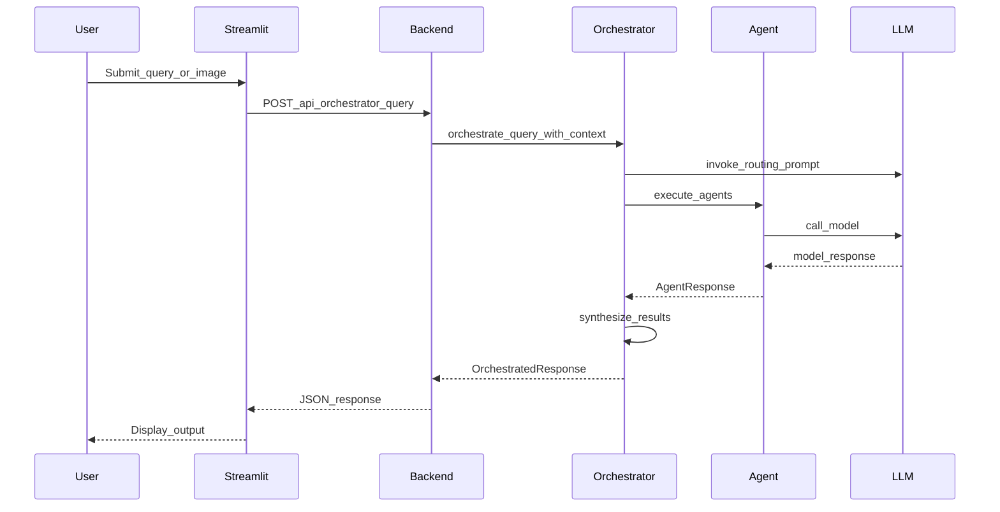

# 🏥 Multi-Agent Healthcare AI System

A concise developer-focused view of the multi-agent healthcare AI project with architecture, data flow, and technology stack.

## High-level architecture
The system splits responsibilities across a Streamlit UI, a FastAPI backend (optional), a LeadAgent Orchestrator, specialist agents, LLM providers, a three-tier memory system, and structured logging. The orchestrator performs LLM-based routing, agent execution (single/parallel/sequential), and synthesis.

## Component architecture
- Streamlit UI: landing + multi-page triage in [`app.py`](app.py:10) and [`pages/`](pages/:1).
- FastAPI backend: REST endpoints and routers in [`backend/main.py`](backend/main.py:24) and [`backend/routers/`](backend/routers/:1).
- LeadAgent Orchestrator: routing, execution, synthesis in [`utils/orchestrator.py`](utils/orchestrator.py:55).
- Agents: specialist implementations in [`agents/`](agents/:1); MUST subclass [`utils/agent_base.py`](utils/agent_base.py:55).
- Prompts & guardrails: templates and strict output formats in [`utils/prompts.py`](utils/prompts.py:40).
- Memory: conversation, consultations, audit in [`utils/memory.py`](utils/memory.py:53).
- Logging: structured logs and LLM interaction capture in [`utils/logger.py`](utils/logger.py:31).

## System architecture & design constraints
- Run components from the repository root (many modules append parent dir to sys.path; see [`backend/main.py`](backend/main.py:17)).
- Safety-first: orchestrator short-circuits emergencies using a keyword list (`utils/orchestrator.py`).
- Prompt-output strictness: templates in [`utils/prompts.py`](utils/prompts.py:220) must be preserved verbatim — changing headings or wording breaks regex parsers/validators.
- Agents are designed to be stateless; memory and audit trail are maintained centrally by the orchestrator.
- `./logs/` is auto-created on import; LLM interactions are written to `logs/llm_interactions.log`.

## Data flow architecture
- UI collects input (text / image) and either calls backend API or directly invokes orchestrator.
- Orchestrator pipeline: analyze_query() → safety check → LLM routing → execute agent(s) → synthesize_results() → return OrchestratedResponse.
- Image workflows require explicit image context — Derm/CXR agents are only selected when an image is present (see [`utils/prompts.py`](utils/prompts.py:726)).
- Memory logging hooks: add_user_message, log_agent_consultation, log_orchestration_event (see [`utils/memory.py`](utils/memory.py:76)).

## Technology stack (detailed)
- Python 3.12, Pydantic v2 (see `pyproject.toml`).
- Streamlit 1.29.0 for UI (`app.py`).
- FastAPI + Uvicorn for backend (`backend/main.py`).
- LangChain + langchain-openai for orchestration; tests use `langchain_openai.ChatOpenAI`.
- OpenAI (primary LLM) and optional HuggingFace models for image/local inference.
- Frontend (optional) React + Vite in [`frontend/`](frontend/package.json:5).
- Logging: RotatingFileHandler + JSON logs written to `./logs/` (`utils/logger.py`).
- Tests: standalone scripts (not pytest) — see [`test_lead_agent.py`](test_lead_agent.py:7).

## Deployment notes
- Local dev: run Streamlit or backend + frontend as needed; run from repo root to ensure imports.
- Production: containerize services, centralize logs and secrets, do not store API keys in the repo.
- Pydantic Settings read `.env` by default; ensure required env vars (OPENAI_API_KEY) are available (`backend/config.py`).

## References (code pointers)
- Orchestrator: [`utils/orchestrator.py`](utils/orchestrator.py:55)
- Prompts & guardrails: [`utils/prompts.py`](utils/prompts.py:40)
- Agent base class: [`utils/agent_base.py`](utils/agent_base.py:55)
- Memory: [`utils/memory.py`](utils/memory.py:53)
- Logging: [`utils/logger.py`](utils/logger.py:31)

End.
